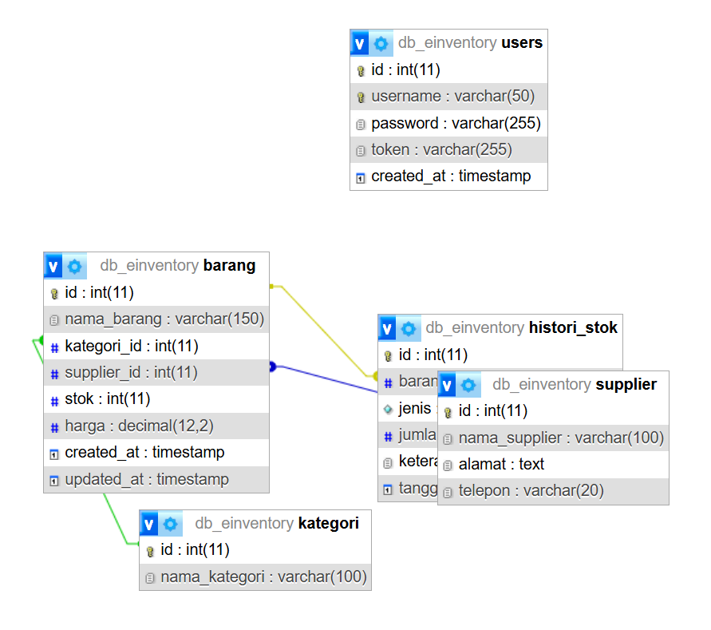
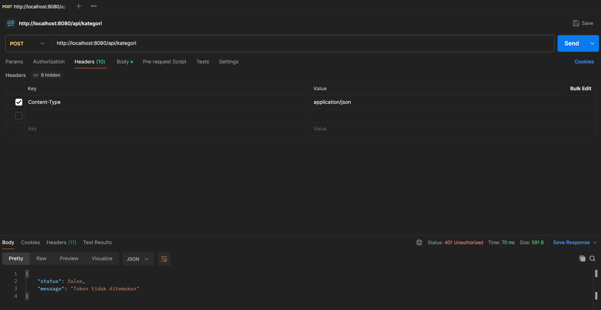
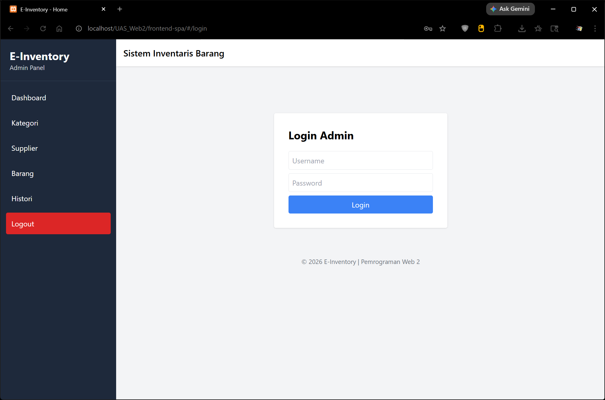
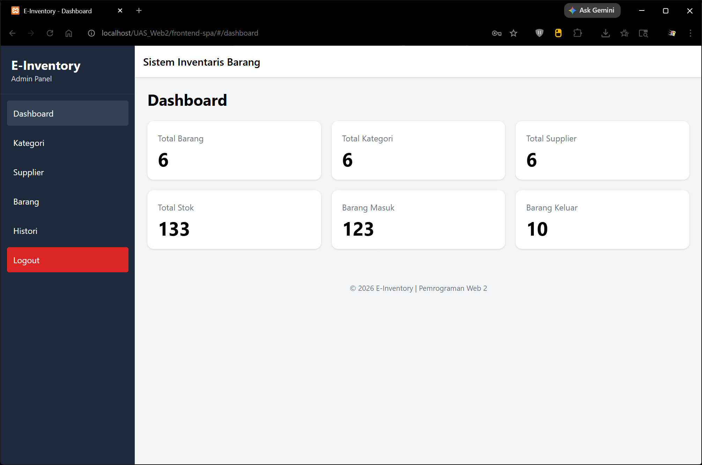
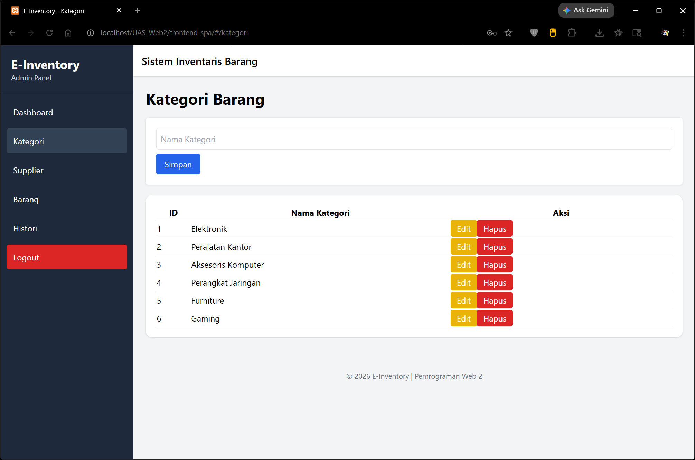
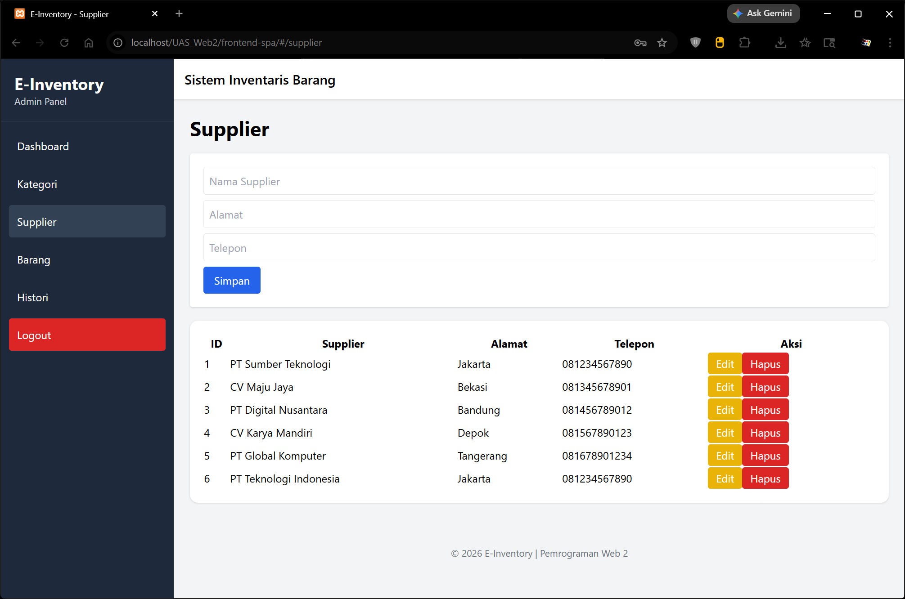
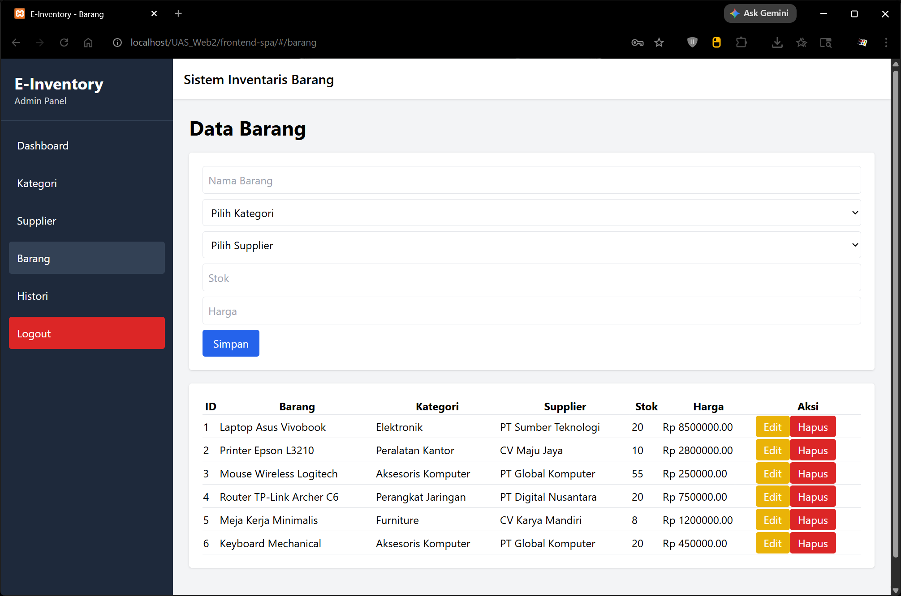
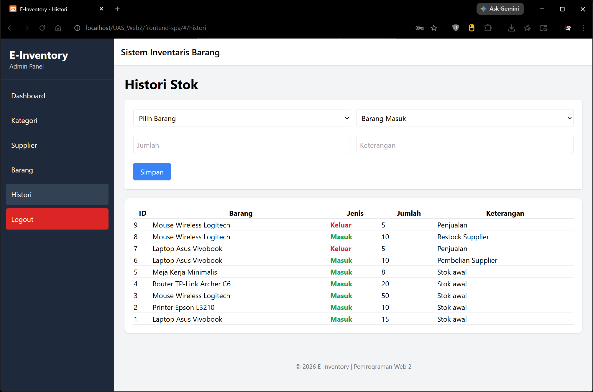
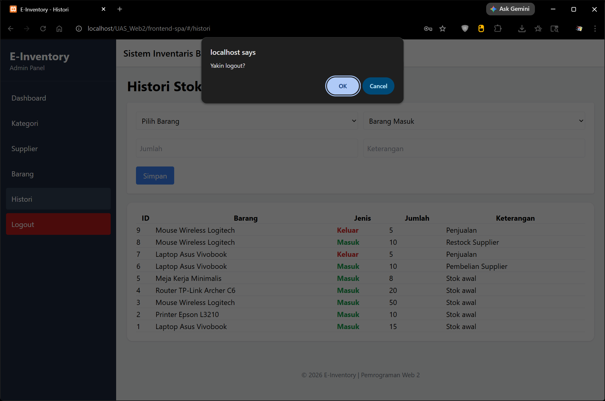

# UAS_Web2_312410423_Roufan-Awaluna-Romadhon

- Nama : Roufan Awaluna Romadhon
- NIM : 312410423
- Kelas : I241C

---

# E-Inventory Management System

## Deskripsi

E-Inventory Management System merupakan aplikasi manajemen inventaris barang berbasis web yang dibangun menggunakan **CodeIgniter 4** sebagai Backend REST API dan **Vue.js 3** sebagai Frontend Single Page Application (SPA). Sistem ini dirancang untuk membantu pengelolaan data barang, kategori, supplier, serta pencatatan histori keluar masuk barang secara terintegrasi.

---

## Fitur Utama

### Autentikasi

* Login Admin
* Logout
* Bearer Token Authentication
* Protected API Endpoint
* Navigation Guard (Vue Router)

### Dashboard

* Total Barang
* Total Kategori
* Total Supplier
* Total Stok
* Total Barang Masuk
* Total Barang Keluar

### Manajemen Kategori

* Tambah Kategori
* Ubah Kategori
* Hapus Kategori
* Lihat Daftar Kategori

### Manajemen Supplier

* Tambah Supplier
* Ubah Supplier
* Hapus Supplier
* Lihat Daftar Supplier

### Manajemen Barang

* Tambah Barang
* Ubah Barang
* Hapus Barang
* Relasi Kategori dan Supplier

### Histori Stok

* Barang Masuk
* Barang Keluar
* Update Stok Otomatis
* Riwayat Transaksi Stok

---

## Teknologi yang Digunakan

### Backend

* PHP 8+
* CodeIgniter 4
* MySQL
* REST API
* Custom Authentication Filter
* CORS Filter

### Frontend

* Vue.js 3
* Vue Router
* Axios
* Axios Interceptor
* Tailwind CSS

---

## Struktur Database

### Tabel User

* id
* username
* password
* token

### Tabel Kategori

* id
* nama_kategori

### Tabel Supplier

* id
* nama_supplier
* alamat
* telepon

### Tabel Barang

* id
* nama_barang
* kategori_id
* supplier_id
* stok
* harga

### Tabel Histori Stok

* id
* barang_id
* jenis
* jumlah
* keterangan

---

## Struktur Project

```text
UAS_Web2
│
├── backend-api/
│   ├── app/
│   ├── public/
│   ├── writable/
│   └── system/
│
└── frontend-spa/
    ├── components/
    │   ├── Dashboard.js
    │   ├── Login.js
    │   ├── Kategori.js
    │   ├── Supplier.js
    │   ├── Barang.js
    │   └── Histori.js
    │
    ├── js/
    │   ├── axios.js
    │   ├── router.js
    │   └── app.js
    │
    └── index.html
```

---

## Instalasi Backend

1. Clone repository

```bash
git clone <repository-url>
```

2. Masuk ke folder backend

```bash
cd backend-api
```

3. Install dependency

```bash
composer install
```

4. Konfigurasi database pada file `.env`

```env
database.default.hostname = localhost
database.default.database = db_inventory
database.default.username = root
database.default.password =
database.default.DBDriver = MySQLi
```

5. Jalankan migration atau import database

6. Jalankan server

```bash
php spark serve
```

Backend akan berjalan pada:

```text
http://localhost:8080
```

---

## Instalasi Frontend

Buka folder:

```text
frontend-spa
```

Kemudian akses melalui browser:

```text
http://localhost/UAS_Web2/frontend-spa
```

Pastikan file `axios.js` mengarah ke URL backend yang sesuai.

Contoh:

```javascript
const api = axios.create({
    baseURL: 'http://localhost:8080/api'
});
```

atau

```javascript
const api = axios.create({
    baseURL: 'http://localhost/UAS_Web2/backend-api/public/api'
});
```

---

## Keamanan Sistem

### Navigation Guard

Digunakan untuk membatasi akses halaman frontend agar hanya dapat diakses oleh pengguna yang telah login.

### Axios Interceptor

Digunakan untuk mengirim Bearer Token secara otomatis pada setiap request API.

### Auth Filter

Digunakan untuk memverifikasi token pada sisi server sebelum mengakses endpoint yang dilindungi.

---

## REST API Endpoint

### Authentication

| Method | Endpoint    |
| ------ | ----------- |
| POST   | /api/login  |
| POST   | /api/logout |

### Dashboard

| Method | Endpoint       |
| ------ | -------------- |
| GET    | /api/dashboard |

### Kategori

| Method | Endpoint           |
| ------ | ------------------ |
| GET    | /api/kategori      |
| POST   | /api/kategori      |
| PUT    | /api/kategori/{id} |
| DELETE | /api/kategori/{id} |

### Supplier

| Method | Endpoint           |
| ------ | ------------------ |
| GET    | /api/supplier      |
| POST   | /api/supplier      |
| PUT    | /api/supplier/{id} |
| DELETE | /api/supplier/{id} |

### Barang

| Method | Endpoint         |
| ------ | ---------------- |
| GET    | /api/barang      |
| POST   | /api/barang      |
| PUT    | /api/barang/{id} |
| DELETE | /api/barang/{id} |

### Histori Stok

| Method | Endpoint     |
| ------ | ------------ |
| GET    | /api/histori |
| POST   | /api/histori |

## Dokumentasi Pengujian dan Tampilan Sistem

### Skema Relasi Database

Screenshot berikut menampilkan relasi antar tabel pada database E-Inventory yang dibuat menggunakan fitur Designer pada phpMyAdmin.



---

### Pengujian Keamanan API (Unauthorized Access)

Pengujian dilakukan menggunakan Postman dengan mencoba mengakses endpoint yang dilindungi tanpa menyertakan Bearer Token.

Endpoint yang diuji:

```http
GET /api/kategori
```

Hasil pengujian:

```json
{
    "status": 401,
    "error": 401,
    "messages": {
        "error": "Unauthorized"
    }
}
```

Hal ini menunjukkan bahwa Auth Filter pada CodeIgniter 4 berhasil mencegah akses ke endpoint yang membutuhkan autentikasi.



---

### Tampilan Halaman Web

Halaman Login



Note:

Username: admin
Password: admin123

Halaman Dashboard



Halaman Kategori



Halaman Supplier



Halaman Barang



Halaman Histori



Tampilan Logout



---

### Link Video

https://youtu.be/rofuiDZfSBo

### Link Aplikasi Website

https://ropane-inventoryuas.my.id/#/

Note:

Username: admin
Password: admin123

---
